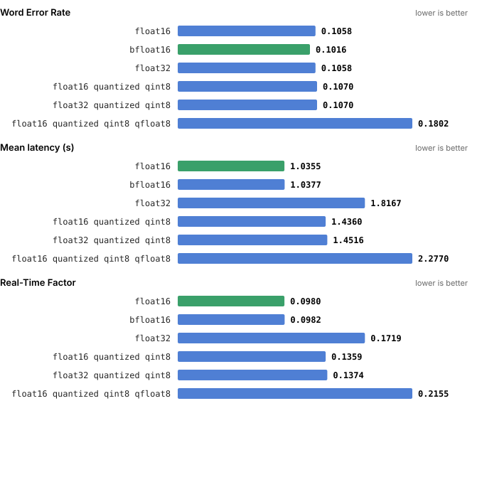
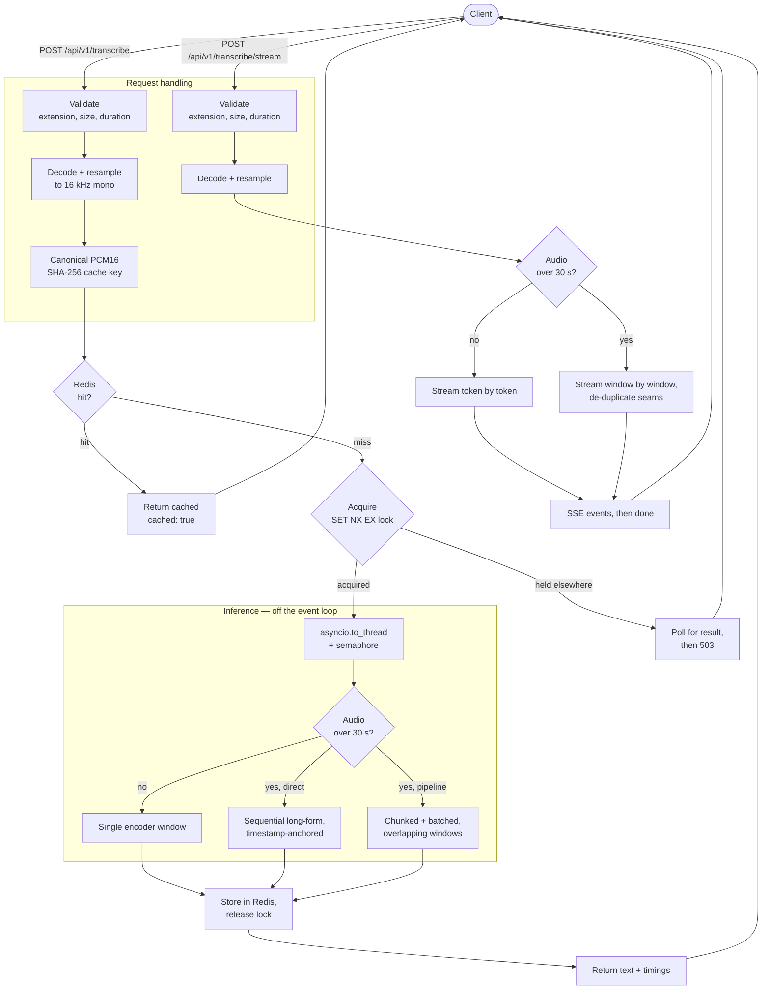

# whisper-asr-service

A serving layer around [Whisper large-v3](https://huggingface.co/openai/whisper-large-v3): a
FastAPI service with two interchangeable inference backends, token-level streaming over SSE,
Redis-backed caching, correct handling of audio longer than Whisper's 30-second window, and a
reproducible harness for the quantization experiments that chose its default configuration.

I built it to answer a question I kept guessing at: **does quantizing Whisper actually make it
faster, or only smaller?** The short answer turned out to be "only smaller" — and the reason is
more interesting than the result. [The experiments are written up in full](docs/EXPERIMENTS.md).

[](https://github.com/MikeMitsios/whisper-asr-service/actions/workflows/ci.yml)


---

## Results

Whisper large-v3, 50 samples from [Emilia-Dataset](https://huggingface.co/datasets/amphion/Emilia-Dataset)
(English), single NVIDIA GPU, `direct` backend.



| Configuration | WER | CER | BLEU | Mean latency | RTF |
|---|---:|---:|---:|---:|---:|
| **bfloat16** | **0.1016** | **0.0343** | **84.61** | 1.038 s | 0.0982 |
| float16 | 0.1058 | 0.0362 | 84.09 | **1.035 s** | **0.0980** |
| float32 (baseline) | 0.1058 | 0.0362 | 84.09 | 1.817 s | 0.1719 |
| float16 + int8 weights | 0.1070 | 0.0364 | 83.87 | 1.436 s | 0.1359 |
| float32 + int8 weights | 0.1070 | 0.0364 | 83.87 | 1.452 s | 0.1374 |
| float16 + int8 weights + fp8 activations | 0.1802 | 0.0704 | 72.85 | 2.277 s | 0.2155 |
| float32 + int4 weights + int8 activations † | 0.2305 | 0.1618 | 68.66 | 34.658 s | 3.3102 |

† 10 samples, not 50 — not directly comparable, and excluded from the chart.

**bfloat16 is the default this project ships**, in `configs/default.yml`. It has the lowest error
rate of anything tested, and it halves float32's latency while very slightly *beating* it on
quality. Every quantized configuration was slower than plain bfloat16 —
[why that happens](docs/EXPERIMENTS.md#why-quantization-did-not-help) is the substance of the
write-up.

The `wer_normalized`, `p50_time_s`, `p95_time_s` and `model_size_mb` columns were added after
these runs and are empty for them; they populate on any new run. Reproducing the table needs a
GPU — see [Evaluation](#evaluation).

---

## Architecture



[`docs/ARCHITECTURE.md`](docs/ARCHITECTURE.md) covers the decisions behind this — why the cache key
hashes decoded PCM rather than upload bytes, why inference is pushed to a thread behind a
semaphore, and why streaming long audio cannot be token-level.

---

## Quickstart

### Docker

```bash
docker compose up -d
```

That starts Redis and the API with `configs/cpu.yml` (whisper-tiny on CPU), so it runs on any
machine. First boot downloads model weights; the container reports healthy once `/health` answers.

```bash
curl http://localhost:8000/health
```

If port 8000 or 6379 is already taken:

```bash
API_PORT=8010 REDIS_PORT=6390 docker compose up -d
```

For GPU inference, with the [NVIDIA Container Toolkit](https://docs.nvidia.com/datacenter/cloud-native/container-toolkit/install-guide.html)
installed. This switches to `configs/default.yml` (large-v3, bfloat16, CUDA) and builds with the
CUDA torch wheels:

```bash
docker compose -f docker-compose.yml -f docker-compose.gpu.yml up -d
```

### Local

```bash
pip install -r requirements-cpu.txt          # or requirements.txt for CUDA 12.8
pip install -e ".[dev,eval,viz]" --no-deps
CONFIG_PATH=configs/cpu.yml uvicorn app.main:app --reload
```

`ffmpeg` and `libsndfile` need to be installed for mp3, m4a and ogg decoding. On a POSIX shell,
`make help` lists shortcuts for all of the above.

---

## API

| Method | Endpoint | Purpose |
|---|---|---|
| `GET` | `/health` | Liveness. No dependencies, no model. |
| `GET` | `/` | What this instance is configured to do. |
| `POST` | `/api/v1/transcribe` | Upload audio, get a transcript. |
| `POST` | `/api/v1/transcribe/stream` | Upload audio, get an SSE stream. |

Accepts WAV, MP3, FLAC, OGG, M4A, MPGA and WEBM. Swagger UI at `/docs`.

```bash
curl -X POST http://localhost:8000/api/v1/transcribe -F "file=@audio.mp3"
```

```json
{
  "text": "the transcript",
  "duration_s": 12.4,
  "inference_ms": 431.2,
  "cached": false,
  "backend": "direct"
}
```

Streaming emits `{"token": "..."}` events followed by `{"done": true}`, or `{"error": "..."}` if
generation fails:

```bash
curl -N -X POST http://localhost:8000/api/v1/transcribe/stream -F "file=@audio.mp3"
```

Errors are `400` for an unsupported extension, an empty body or undecodable audio; `413` when the
upload or its duration exceeds the configured limit; `422` for a missing file; `503` when an
identical request is already in flight and does not finish in time.

---

## How it works

### Two backends, two long-form algorithms

Whisper's encoder takes a fixed 30-second window. Longer audio has to be split, and there are two
published ways to do it. This project exposes both, because they trade off differently, and maps
each onto one backend.

**`direct` — sequential.** Feed the first window; the model emits timestamp tokens alongside the
text. Read the last timestamp to decide where the next window starts, and pass the previous
window's text back as a decoder prompt so context carries across the seam. Cuts land on
model-chosen boundaries rather than mid-word. Most accurate, and strictly sequential.

**`pipeline` — chunked and batched.** Slice into 30-second windows with overlap on each side,
transcribe every window independently, then stitch the overlaps. Windows are independent, so they
batch — much faster on long files, at a small accuracy cost.

`default_backend` picks one. Audio within a single window takes the same short path in both.

### Caching

Uploads are decoded, resampled to 16 kHz mono, and hashed as canonical 16-bit PCM. The key is
therefore a property of the *audio*, not of the container it arrived in: a WAV and a lossless FLAC
of one recording share a cache entry. On a miss, a `SET NX EX` lock stops two identical concurrent
uploads from both running inference. Every Redis call is fail-open — with Redis down the service
works, just without caching.

### Configuration

Everything lives in one YAML file, selected by `CONFIG_PATH`. Two are shipped:
`configs/default.yml` (large-v3, bfloat16, CUDA — the configuration the experiments chose) and
`configs/cpu.yml` (whisper-tiny, CPU — what Docker and the tests use).

| Key | Default | Description |
|---|---|---|
| `model_id` | `openai/whisper-large-v3` | HuggingFace model ID |
| `device` | `cuda` | `cuda` or `cpu` |
| `default_backend` | `direct` | `direct` or `pipeline` |
| `torch_dtype` | `bfloat16` | `float16`, `bfloat16` or `float32` |
| `target_sample_rate` | `16000` | Resampling target |
| `enable_streaming` | `true` | Register the SSE route |
| `compile_model` | `false` | `torch.compile`; long warm-up, little gain on CPU |
| `long_form_mode` | `auto` | `auto` splits past one window, `off` truncates |
| `chunk_length_s` | `30` | Encoder window, seconds |
| `stride_length_s` | `5` | Overlap per side |
| `batch_size` | `8` | Windows per batch, `pipeline` only |
| `max_audio_seconds` | `600` | Over this, `413` |
| `max_upload_mb` | `50` | Over this, `413` |
| `max_concurrent_inferences` | `1` | One model, so contention is explicit |
| `cors_allow_origins` | `["*"]` | Credentials enabled only when pinned |
| `quantized_config` | unset | `weights` and `activations` quanto types |
| `enable_calibration` | `false` | Required when quantizing activations |
| `redis_url` | `redis://localhost:6379/0` | Overridden by `REDIS_URL` |
| `cache_ttl` | `3600` | Cache entry lifetime, seconds |

An unrecognised value for any constrained key raises at startup rather than falling back to a
default. A config that quietly runs something other than what it asked for is how two rows of the
results table came to be mislabelled in the first place.

---

## Tests

```bash
pytest                 # 83 tests, ~8s, offline: no server, no weights, no network
pytest -m slow         # real whisper-tiny on CPU, ~2 min
pytest -m integration  # needs Redis: docker compose up -d redis
```

The default suite synthesizes its own audio and injects a fake transcriber, so it needs neither a
running server nor model weights. Emilia-Dataset audio is deliberately **not** committed — it is
CC BY-NC with additional terms.

---

## Evaluation

Reproducing the results table needs GPU hardware and
[Emilia-Dataset](https://huggingface.co/datasets/amphion/Emilia-Dataset) access (accept the terms,
then `huggingface-cli login`).

```bash
python scripts/evaluation.py --num-samples 50 --language en
python scripts/visualize.py           # interactive Bokeh dashboard
python scripts/make_results_chart.py  # static SVG for this README
```

Recorded per run: WER, CER and BLEU raw; WER and CER after Whisper's own text normalization; mean,
p50 and p95 latency; real-time factor; in-memory model size.

| Script | Purpose |
|---|---|
| `evaluation.py` | Evaluate on Emilia-Dataset, append a row to `evaluation_results.csv` |
| `visualize.py` | Render the CSV as an interactive Bokeh dashboard |
| `make_results_chart.py` | Render the CSV as a static SVG for this README |
| `quantization.py` | Quantize a model and report the size reduction |
| `emilia_demo.py` | Transcribe a few dataset samples, batch or streaming |
| `upload_to_hf.py` | Push a local model directory to the Hub |

---

## Limitations

Stated plainly, because each one is a real boundary of what this does today.

- **No VAD.** Silence is transcribed at full cost. Pre-segmenting with Silero VAD would cut
  wall-clock substantially on sparse audio — voicemail, meetings, podcasts with gaps.
- **Streaming long audio is window-level, not token-level.** Unavoidable as built: windows are
  anchored on predicted timestamps, which requires the decode to have finished, and temperature
  fallback needs several generate passes while `TextIteratorStreamer` closes after the first.
  Audio within one window still streams per token.
- **One model per process, no cross-request batching.** `max_concurrent_inferences` defaults to 1
  because concurrent `generate` calls on a single model contend rather than parallelise. Real
  throughput would need a batching queue grouping requests by arrival window.
- **No word-level timestamps in the API.** They exist internally — sequential long-form depends on
  them — but are not surfaced in the response.
- **Emilia is the only evaluation corpus**, and the sample is English-only. LibriSpeech and Common
  Voice would say more about generalisation.
- **No metrics endpoint.** Latency and cache status are per-response, not aggregated; Prometheus
  counters are the obvious next addition.
- **Quantized configs may need a build toolchain** that the deliberately slim runtime image omits.

---

## Project layout

```
app/                     FastAPI application
  main.py                Lifespan, CORS, health and info routes
  cache.py               Fail-open async Redis helpers
  routers/
    _common.py           Validation, decoding, size and duration guards
    asr.py               POST /api/v1/transcribe
    asr_streaming.py     POST /api/v1/transcribe/stream
src/whisper_asr/         Core library, importable on its own
  config.py              YAML loading with strict validation
  whisper_model.py       Model loading, both backends, long-form, quantization
  transcriber.py         Config-driven orchestrator
  audio_utils.py         Decoding and resampling
  quantization.py        Quanto helpers, QTensor-aware size measurement
  evaluator.py           WER, CER, BLEU, latency percentiles, RTF
  text_normalization.py  Whisper's normalizers, for comparable WER
  load_data.py           Emilia-Dataset streaming loader
scripts/                 Evaluation, visualization, quantization, upload
tests/                   Offline by default; slow and integration markers
configs/                 default.yml (GPU) and cpu.yml
docs/                    Architecture and experiment write-ups
```

---

## License

MIT — see [LICENSE](LICENSE).
