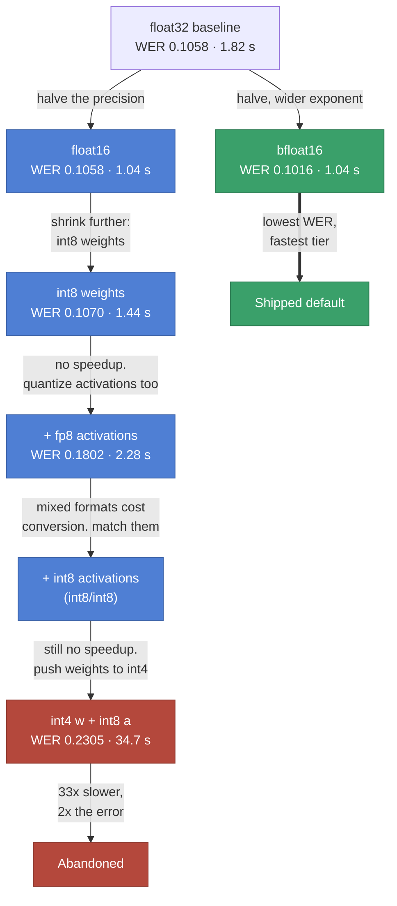

# Quantization experiments

The question: **does quantizing Whisper large-v3 make it faster, or only smaller?**

The answer, on this hardware and this stack, is only smaller. Every quantized configuration was
slower than plain bfloat16, and the most aggressive one was 33× slower. That is not a null result —
*why* it happens is specific and predictable, and it changed the configuration this project ships.

---

## Method

Each configuration is scored on the same 50 English samples streamed from
[Emilia-Dataset](https://huggingface.co/datasets/amphion/Emilia-Dataset), through the same
`Transcriber` and the same `direct` backend, on a single NVIDIA GPU. Quantization uses
[optimum-quanto](https://github.com/huggingface/optimum-quanto), which performs linear
quantization.

The workflow was two-stage, deliberately. `scripts/emilia_demo.py` runs a handful of samples and
prints them, which is enough to see whether a configuration produces sane text and roughly how
long it takes. Only configurations that survived that went to `scripts/evaluation.py` for the full
scored run. Loading large-v3 and scoring 50 samples is expensive; there is no point spending it on
a configuration whose first three transcripts are already garbage.

### Metrics

| Metric | Meaning | Direction |
|---|---|---|
| WER | Word Error Rate: (insertions + deletions + substitutions) / reference words, via [jiwer](https://github.com/jitsi/jiwer) | lower |
| CER | Same at character level. More granular; catches partially-correct words | lower |
| BLEU | N-gram overlap, 0–100, via [sacrebleu](https://github.com/mjpost/sacrebleu) | higher |
| `avg_time_s` | Mean wall-clock inference time per sample | lower |
| `p50` / `p95` | Median and tail latency. Added after these runs | lower |
| RTF | Real-Time Factor: inference time / audio duration. Below 1 is faster than real time | lower |
| `model_size_mb` | In-memory size of parameters and buffers. Added after these runs | lower |

---

## The path through the search space



---

## Results

| Configuration | WER | CER | BLEU | Mean latency | RTF |
|---|---:|---:|---:|---:|---:|
| **bfloat16** | **0.1016** | **0.0343** | **84.61** | 1.038 s | 0.0982 |
| float16 | 0.1058 | 0.0362 | 84.09 | **1.035 s** | **0.0980** |
| float32 (baseline) | 0.1058 | 0.0362 | 84.09 | 1.817 s | 0.1719 |
| float16 + int8 weights | 0.1070 | 0.0364 | 83.87 | 1.436 s | 0.1359 |
| float32 + int8 weights | 0.1070 | 0.0364 | 83.87 | 1.452 s | 0.1374 |
| float16 + int8 weights + fp8 activations | 0.1802 | 0.0704 | 72.85 | 2.277 s | 0.2155 |
| float32 + int4 weights + int8 activations † | 0.2305 | 0.1618 | 68.66 | 34.658 s | 3.3102 |

† 10 samples, not 50. It was cut short precisely because it was so slow, so it is not directly
comparable to the rest and is excluded from the chart in the README.

---

## Reduced precision: the part that worked

float32 to float16 or bfloat16 is the one change that paid off unambiguously. Memory halves, and
latency halves with it — 1.82 s down to 1.04 s.

bfloat16 came out marginally *better* than float32 on quality (WER 0.1016 against 0.1058), which
looks wrong until you consider that a 0.4-point WER difference over 50 samples is a handful of
words. The honest reading is that bfloat16 is quality-neutral against float32 here, and that
bfloat16's wider exponent range makes it the safer of the two half-precision formats — it will not
overflow where float16 might.

float16 and float32 produced **byte-identical** WER, CER and BLEU. Same decoded text, so the
precision reduction changed nothing the tokenizer could see on this sample.

---

## Why quantization did not help

### int8 weights: smaller, not faster

Quantizing weights to int8 shrank the model substantially and did nothing for latency — 1.44 s
against bfloat16's 1.04 s, actually *worse*.

The cause is that the backend never ran int8 matrix multiplications. Without optimized int8 GEMM
kernels for this shape and device, quanto stores weights as int8 and then **dequantizes them back
to floating point at every matmul**. The arithmetic still happens in fp16 or fp32, and now there is
an unpacking step in front of it that did not exist before. Memory drops, compute does not get
faster, and the conversion overhead is pure addition.

This is the single most important finding here, and it generalises: **weight-only quantization is a
memory optimization, not a speed optimization, unless the kernels exist to consume the quantized
format directly.** If the model fits in memory already, weight-only quantization buys nothing.

### Activation quantization needs calibration

If the compute stays in float because activations are float, the next move is to quantize
activations too.

Activations differ from weights in one crucial way: weights are fixed after training and can be
quantized by inspection, while activations depend on the input and are not known ahead of time.
Linear quantization needs a scale — a mapping from a floating-point range onto int8's 256 levels —
and estimating that range requires pushing representative data through the model and recording what
comes out. Skip it and the scales are unset, activations saturate, and accuracy collapses.

So the framework grew a calibration path: `enable_calibration: true` streams samples through the
model inside quanto's `Calibration` context before `freeze()`. It is in
[`whisper_model.py`](../src/whisper_asr/whisper_model.py) as `_calibrate_model`.

### Mixed formats add a conversion no one asked for

The first activation experiment used **int8 weights with fp8 activations**. Latency got worse
again — 2.28 s — and quality fell off a cliff, WER 0.1058 to 0.1802.

Mixing formats is the problem. When weights and activations are in different representations, one
has to be converted to match the other before every multiply. That conversion is per-operation
overhead on top of the dequantization that was already happening, which is why this configuration
is the slowest of the non-int4 runs.

### Matching the formats did not rescue it

Setting both weights and activations to int8 removed the format mismatch. Latency still did not
improve, for the same underlying reason as before: no int8 kernels, so the values were being
dequantized anyway and the matching formats saved a conversion that was incidental rather than
dominant.

### int4 weights: where it fell apart

The most aggressive configuration — int4 weights, int8 activations — was **34.7 s per sample**
against bfloat16's 1.04 s, an RTF of 3.31, meaning it took over three seconds of compute per second
of audio. WER more than doubled to 0.2305 and CER nearly quintupled to 0.1618.

int4 has no native compute path at all. Every weight is unpacked from 4-bit storage, widened, and
fed to a float matmul. The unpacking is more expensive than int8's, the accuracy loss from 16
representable levels is severe, and nothing is gained in exchange.

This run was stopped at 10 samples rather than 50, which is why its row carries a caveat. At 34.7 s
per sample the full run would have taken half an hour to confirm what the first ten samples already
showed.

---

## Conclusion

**bfloat16 with no quantization** is what this project ships, in
[`configs/default.yml`](../configs/default.yml). It is the lowest-error configuration tested, it is
in the fastest latency tier, and it is the simplest — no calibration step, no quanto dependency at
inference time, no failure modes to reason about.

The generalisable lesson is about *why* to quantize. Quantization trades compute for memory, and
the trade only pays when either memory is the binding constraint or the hardware has kernels that
consume the quantized format natively. Neither was true here: large-v3 in bfloat16 fits comfortably
on the GPU, and the int8 and int4 paths had no native kernels. So every quantized configuration
paid the conversion cost and collected none of the benefit.

Where it *would* pay: fitting a larger model onto a smaller card, or serving on hardware with real
int8 tensor core support and a backend that uses it.

---

## Notes on data integrity

Two things about this table are worth stating rather than quietly fixing.

**Two rows were originally mislabelled `float8`.** `_DTYPE_MAP` in `whisper_model.py` never had a
`float8` entry, and the lookup used `.get(name, torch.float32)` — so a config asking for
`torch_dtype: float8` silently got float32 and the run was recorded under the wrong name. The rows
now say what actually ran. No metric was touched.

The data corroborates the correction. `float16 + int8 weights` and the row formerly called
`float8 + int8 weights` have byte-identical WER, CER and BLEU — which is exactly what you would
predict if both collapsed to the same int8 weights, one from fp16 and one from fp32. Their latencies
differ slightly (1.436 s against 1.452 s), consistent with two separate runs of the same
computation.

`resolve_dtype` now raises on an unrecognised name instead of falling back, and there is a test
asserting `float8` stays unsupported, so this cannot recur.

**Four columns are empty for these rows.** `wer_normalized`, `cer_normalized`, `p50_time_s`,
`p95_time_s` and `model_size_mb` were added afterwards. They populate on any new run. They are not
back-filled, because a derived number sitting in a column of measured ones is exactly the kind of
thing that becomes a false claim later.

Normalized WER matters for comparability: raw WER counts punctuation and casing as errors, so it
runs higher than the figures Whisper's own model card reports, which are normalized. Expect the
normalized numbers to come in meaningfully below the raw ones in the table above.

---

## Reproducing

Needs a GPU and Emilia-Dataset access (accept the terms, then `huggingface-cli login`).

```bash
# Sanity-check a configuration on a few samples first
python scripts/emilia_demo.py --num-samples 3

# Full scored run, appends one row to evaluation_results.csv
python scripts/evaluation.py --num-samples 50 --language en

# Regenerate the charts
python scripts/visualize.py
python scripts/make_results_chart.py
```

Edit `configs/default.yml` between runs to change the configuration under test:

```yaml
torch_dtype: bfloat16
quantized_config:
  weights: qint8       # qint2 | qint4 | qint8 | qfloat8
  activations: qint8   # or null for weight-only
enable_calibration: true   # required whenever activations are quantized
```

The run's row is named from the config, so the label always reflects what actually executed.
